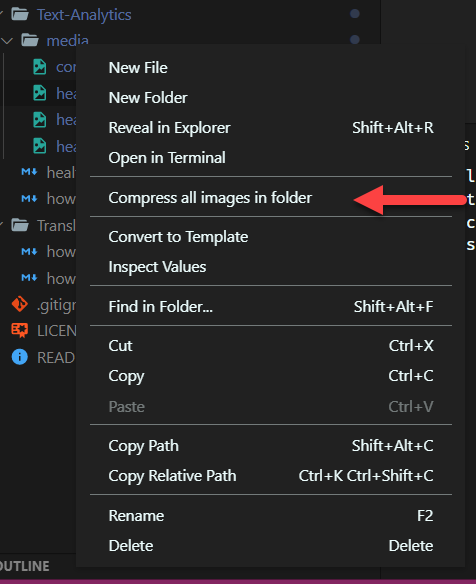

# Docs Images

Docs Images provides image compression and resizing for folders and individual files to help authors for docs.microsoft.com:

* [Docs Images](https://marketplace.visualstudio.com/items?itemName=docsmsft.docs-images) by [David Pine](https://github.com/IEvangelist), which compresses and resizes images.

## How to use the Docs Image extension

To access the Docs Images menu, right click on a folder or individual image file. Select the "Compress all images in folder" or "Compress image" for the context menu.

Once the Docs Image extension is run you can view the output console to view the compression and resizing details.

## Contributing

This project welcomes contributions and suggestions.  Most contributions require you to agree to a
Contributor License Agreement (CLA) declaring that you have the right to, and actually do, grant us
the rights to use your contribution. For details, visit https://cla.microsoft.com.

When you submit a pull request, a CLA-bot will automatically determine whether you need to provide
a CLA and decorate the PR appropriately (e.g., label, comment). Simply follow the instructions
provided by the bot. You will only need to do this once across all repos using our CLA.

This project has adopted the [Microsoft Open Source Code of Conduct](https://opensource.microsoft.com/codeofconduct/).
For more information see the [Code of Conduct FAQ](https://opensource.microsoft.com/codeofconduct/faq/) or
contact [opencode@microsoft.com](mailto:opencode@microsoft.com) with any additional questions or comments.

## License

[MIT](LICENSE)
